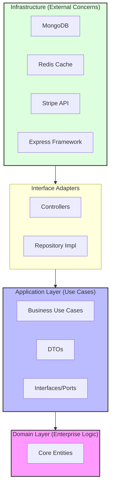

# DevCollab API - Developer Collaboration & Project Management Platform

**DevCollab Backend** serves as the high-performance backbone of the DevCollab platform. It is engineered to demonstrate **Enterprise-Grade** design patterns, focusing on long-term maintainability, testability, and separation of concerns.

## 🏗️ Architectural Philosophy

This system implements **Clean Architecture ** to strictly decouple business logic from infrastructure frameworks. This ensures that the core domain remains pure and adaptable to technology shifts.



### Key Design Decisions
1.  **Dependency Injection (InversifyJS)**: All dependencies are injected at runtime, allowing for effortless unit testing and modularity.
2.  **Repository Pattern**: The application is agnostic of the database. MongoDB is currently used, but the `IRepository` interfaces allow for swapping to SQL without touching business logic.
3.  **DTOs & Mappers**: Strict data contracts ensure that internal database structures are never leaked to the client.

## ⚡ Technical Highlights

### Real-time Event Engine
Powered by **Socket.io**, the backend handles thousands of concurrent connections for instant updates.
- **Room-based Partitioning**: Efficiently routes events only to relevant project participants.
- **Optimistic Concurrency**: Handling high-frequency updates on Kanban boards.

### High-Performance Caching
Utilizing **Redis** to reduce database load for frequent read operations.
- **Session Management**: Fast, distributed session handling.
- **Data Caching**: Caching expensive aggregation queries for dashboards.

### Secure Transactions
Integrated **Stripe Connect** for complex marketplace flows.
- **Escrow Logic**: Custom state machines to manage transaction lifecycles (Pending -> Held -> Released).
- **Webhooks**: Resilient webhook handlers with signature verification.

## 🛠️ Technology Stack

| Category | Technology | Usage |
|----------|------------|-------|
| **Runtime** | Node.js / Express | API Gateway & Routing |
| **Language** | TypeScript | Strict Type Safety |
| **Database** | MongoDB + Mongoose | Flexible Document Design |
| **Cache** | Redis | Performance & Pub/Sub |
| **Testing** | Jest | Unit & Integration Testing |
| **DevOps** | Docker | Containerization |

## 🚀 Deployment & Setup

### Requirements
- Node.js 20+
- MongoDB instance
- Redis instance

### Quick Start
1.  **Clone & Install**
    ```bash
    git clone https://github.com/Arunjith5452/DevCollab-Backend.git
    npm install
    ```

2.  **Environment Configuration**
    ```env
    PORT=4000
    MONGO_URI=mongodb://localhost:27017/devcollab
    REDIS_HOST=localhost
    etc ...
    ```

3.  **Run Service**
    ```bash
    npm run dev
    ```

## 🔗 Client Application
The public face of this API.
👉 **[View Frontend Showcase](https://github.com/Arunjith5452/DevCollab-Frontend)**
