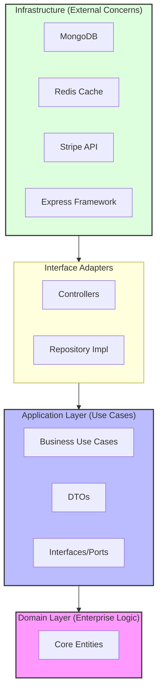

<div align="center">

# DevCollab API — High-Performance Core Engine

**The robust backend powering the DevCollab platform.**  
Engineered with Enterprise-Grade design patterns, real-time socket communication, and Clean Architecture.

[](https://nodejs.org)
[](https://www.typescriptlang.org)
[](https://www.mongodb.com/atlas)
[](https://redis.io)
[](https://www.docker.com)
[](https://stripe.com)

</div>

---

## 📋 Table of Contents

- [Overview](#-overview)
- [Architectural Philosophy](#-architectural-philosophy)
- [Technical Highlights](#-technical-highlights)
- [Tech Stack](#-tech-stack)
- [Deployment & Setup](#-deployment--setup)
- [Frontend Application](#-frontend-application)

---

## 🌟 Overview

**DevCollab Backend** serves as the high-performance backbone of the entire DevCollab ecosystem. It focuses on long-term maintainability, testability, and strict separation of concerns, providing the APIs and real-time socket connections necessary to build modern developer tooling.

---

## 🏗️ Architectural Philosophy

This system implements **Clean Architecture** to strictly decouple business logic from infrastructure frameworks. This ensures that the core domain remains pure and adaptable to technology shifts over time.



### Key Design Decisions
1. **Dependency Injection (InversifyJS)**: All dependencies are injected at runtime, allowing for effortless unit testing and modularity.
2. **Repository Pattern**: The application is agnostic of the database. MongoDB is currently used, but the `IRepository` interfaces allow for swapping to SQL without touching business logic.
3. **DTOs & Mappers**: Strict data contracts ensure that internal database structures are never leaked to the client.

---

## ⚡ Technical Highlights

| System Component | Description |
|------------------|-------------|
| 🌐 **Real-time Event Engine** | Powered by **Socket.io** to handle concurrent connections. Uses room-based partitioning and optimistic concurrency for high-frequency board updates. |
| 🚀 **High-Performance Caching** | Utilizes **Redis** for fast, distributed session handling and caching expensive dashboard aggregations to reduce DB load. |
| 🛡️ **Secure Transactions** | Integrated **Stripe Connect** with custom escrow state machines (Pending -> Held -> Released) and resilient webhook handlers. |

---

## 🛠️ Technology Stack

| Layer | Technology | Usage |
|-------|------------|-------|
| **Runtime** | Node.js / Express | API Gateway & Routing |
| **Language** | TypeScript | Strict Type Safety |
| **Database** | MongoDB + Mongoose | Flexible Document Design |
| **Cache** | Redis | Performance & Pub/Sub |
| **Testing** | Jest | Unit & Integration Testing |
| **DevOps** | Docker | Containerization |

---

## 🚀 Deployment & Setup

### Requirements
- Node.js 20+
- MongoDB instance (Atlas or local)
- Redis instance

### Quick Start
1. **Clone & Install**
   ```bash
   git clone https://github.com/Arunjith5452/DevCollab-Backend.git
   cd DevCollab-Backend
   npm install
   ```

2. **Environment Configuration**
   Create a `.env` file in the root:
   ```env
   PORT=4000
   MONGO_URI=mongodb://localhost:27017/devcollab
   REDIS_HOST=localhost
   ```

3. **Run Service**
   ```bash
   npm run dev
   ```

---

## 🔗 Client Application
The public face of this API.
👉 **[Explore the Frontend Architecture](https://github.com/Arunjith5452/DevCollab-Frontend)**

<div align="center">
  <strong>Built with strict typing and clean architecture.</strong>
</div>
